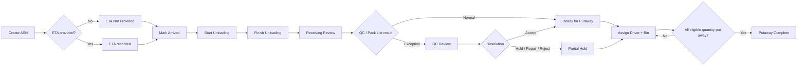

# GreaterWMS Inbound Process and Exception Logic

This document records the current inbound workflow implemented in GreaterWMS. It is a baseline for future UI, CLI, and backend changes.

## 1. Status Model

The system uses two status layers:

- `ASN Status 1-5`: legacy workflow status used by the inbound tabs.
- `Operational Status`: calculated from arrival, receiving quantity, Pack List, SN/QC results, exceptions, and putaway progress. The ASN work queue displays this status.

Legacy status mapping:

| ASN status | Meaning | Inbound tab |
| --- | --- | --- |
| `1` | Pre-arrival / not unloading | Pre Arrival |
| `2` | Unloading in progress | Unloading |
| `3` | Receiving review | Receiving |
| `4` | Putaway in progress | Putaway |
| `5` | Completed or no physical quantity remains | Completed |

## 2. End-to-End Flow

### 2.1 ASN creation and ETA

The customer inbound notice is converted into an ASN containing the ASN code, customer/owner, planned SKU quantities, container/tracking reference, and optional load-unit quantity.

ETA is informational and is separate from physical arrival:

- Missing ETA is shown as `Not provided`.
- Updating ETA does not change inventory or receiving status.
- When the vehicle actually arrives, the warehouse operator uses `Mark Arrived` to record `actual_arrival_at`.
- Unloading cannot start until physical arrival is confirmed.

### 2.2 Staging and unloading

The staging layout contains `STAGE-LEFT-01` through `STAGE-LEFT-20` and `STAGE-RIGHT-01` through `STAGE-RIGHT-20`.

Staging assignments have two relevant states:

| State | Meaning |
| --- | --- |
| `Reserved` | Capacity is reserved, but the physical load has not been unloaded there |
| `Active / Occupied` | The load has been physically unloaded and remains in staging |

Required staging locations are calculated from `package_qty` when available. If it is missing, planned SKU quantity is used as a compatibility fallback. Each selected location must be unique and valid.

`Start Unloading` requires:

- Confirmed physical arrival
- An existing unloading driver
- The exact number of staging locations

It changes ASN status `1 -> 2`, records the unloading driver, and reserves staging locations. `Finish Unloading` changes `2 -> 3`, marks the selected staging locations active, and moves the load into the receiving stage.

Staging remains occupied during receiving and putaway. It is released only after all physical received quantity is put away, or when no physical goods remain after a full shortage.

### 2.3 Pack List

The Pack List is customer shipment detail. It is not another ASN and must not create another inbound order.

The current design supports:

- Pack List received before physical receipt
- Pack List received after receiving as a `Late Reference`
- One current Pack List per ASN
- Archived historical revisions

Pack List status:

| Status | Meaning |
| --- | --- |
| `NOT_RECEIVED` | No customer Pack List is recorded |
| `PENDING` | Imported and waiting for confirmation |
| `CONFIRMED` | Confirmed and usable as the reconciliation baseline |
| `LATE` | Confirmed after receiving started |
| `LATE_PENDING` | Imported after receiving started but not confirmed |

Pack List content is imported by the AI Agent/CLI and stored as structured data. The page displays the current document, SKU reconciliation, and QC history rather than relying on the original file as the system record.

Pack List fields may include internal SKU, customer SKU, S-SKU, quantity, package type, description, weight, volume, and Serial Number. If a different Pack List is imported, the system requires an explicit replacement. After receiving has started, it must be marked as a late reference revision.

### 2.4 Receiving

`Receiving Review` records actual physical quantities by SKU. The important quantities are distinct:

| Field | Meaning |
| --- | --- |
| `Planned Qty` | Quantity expected on the ASN |
| `Received Qty` | Actual physical quantity received |
| `Scanned SN` | Number of received serial records |
| `Accepted for Putaway` | Quantity eligible to move to storage |
| `Putaway Qty` | Quantity already moved to final bins |

SN scan count does not automatically change physical received quantity. For example, 8 physical units and 9 scan records means `Received Qty = 8` and `Scans = 9`; the extra record must be investigated.

Quantity comparison:

| Actual quantity | Result |
| --- | --- |
| `0` | Full shortage; no physical quantity remains to put away |
| Less than planned | `Shortage` exception |
| Equal to planned | Quantity accepted if no other exception exists |
| Greater than planned | `More QTY` exception |

After receiving submission, normal or exception-bearing lines generally move to ASN status `4`. A fully short line can move to status `5`; if no physical goods remain, staging is released.

### 2.5 QC inspection import

QC personnel use a fixed Excel format and do not need to enter every inspection result manually in WMS. The current flow is:

1. Scan and inspect products using the warehouse process.
2. Record SKU, SN, inspection result, damage flag, note, and evidence URL in Excel.
3. Let the AI Agent parse the workbook.
4. Import the result through the CLI/API.
5. Review the resulting reconciliation and exception state in GreaterWMS.

The inspection workbook updates receiving evidence and SN/QC records. It does not create a new ASN or outbound order. Re-importing an inspection workbook updates the existing SN record instead of counting it as another physical scan.

Inspection batch status:

| Status | Meaning |
| --- | --- |
| `PASSED` | Imported inspection has no unresolved exception |
| `EXCEPTION` | Imported inspection contains unresolved exceptions |
| `PARTIAL` | Some rows succeeded while some rows were rejected or skipped |
| `IMPORTED` | Imported but not yet finalized by the workflow |

## 3. Verification Modes

The system selects the verification mode from the available Pack List and expected SN data:

| Mode | Behavior |
| --- | --- |
| `ASN_ONLY` | Quantity receiving without a Pack List; no SN validation |
| `PACK_LIST_QTY` | Pack List quantity/SKU reconciliation without SN validation |
| `PACK_LIST_PENDING` | Pack List with expected SN exists but is not confirmed |
| `PACK_LIST` | Confirmed Pack List with expected SN; strict SN validation |
| `MANUAL_SN` | Expected SN was entered separately |

For quantity-only receiving, a normal physical quantity with no open quantity exception is considered complete even when no SN records exist. This is intentional for customers whose Pack List does not contain serial numbers.

## 4. Exception Branches

### 4.1 Serial exceptions

Possible serial exceptions are `Missing SN`, `Unexpected SN`, `Duplicate SN`, `Wrong SKU`, `Damaged`, and `Rejected`.

Resolution actions:

| Action | Putaway effect |
| --- | --- |
| `ACCEPT_FOR_PUTAWAY` | Unit becomes eligible for putaway |
| `HOLD_QUARANTINE` | Unit stays in a hold/quarantine location |
| `REPAIR_REWORK` | Unit waits for repair and reinspection |
| `REJECT_RETURN` | Unit is rejected or returned |
| `WAIVE_MISSING` | Missing expected SN is explicitly waived |
| `REOPEN` | Reopens a previously resolved exception |

Resolution notes are required. Hold, repair, and reject actions also require a resolution location.
The resolution action itself is a QC decision only. A received exception unit
must then be processed with the explicit `exception move` operation into a
valid non-staging Holding, Inspection, or Damage bin. Missing SN and shortage
records have no physical unit to move. The ASN staging assignment is released
only after accepted units are put away and resolved physical exception units
have also been moved out of staging.

### 4.2 Quantity exceptions

Shortage, overage, or damaged quantity is stored on the ASN detail. The exception must be resolved before the affected quantity can be put away.

- Accepting the exception makes the accepted quantity eligible for putaway.
- Holding, repairing, or rejecting the quantity excludes it from normal putaway.
- Reopening returns the exception to an open state.

The `Shortage` and `More QTY` menus are filtered query lists, not independent state transitions. The actual resolution is performed from the QC/reconciliation workflow or through the CLI/API.

### 4.3 Pack List exceptions

The main Pack List control signals are:

| Signal | Meaning |
| --- | --- |
| `PL Review` | Pack List is imported but not confirmed |
| `PL Mismatch` | ASN and Pack List SKU/quantity totals differ |
| `SN Pending` | Expected serial verification is incomplete |
| `No Pack List` | Customer Pack List has not been provided |
| `QC Pending` | Receiving inspection has not been completed |

An absent Pack List does not automatically block quantity-only receiving or putaway. A pending, mismatched, or serial-incomplete Pack List remains a work-queue attention signal and must be reviewed according to the operational status.

## 5. Putaway Logic

Putaway requires an existing Putaway Driver, a valid final Bin, and a positive quantity.

Rules:

- A staging bin cannot be used as a final storage bin.
- Requested quantity cannot exceed the remaining received quantity.
- With strict SN verification, requested quantity cannot exceed accepted or explicitly approved SN quantity.
- Unresolved quantity, SN, or Pack List reconciliation exceptions block the affected putaway quantity.
- Once a Putaway Driver is assigned to an ASN, another driver cannot be substituted for that ASN.

Each successful putaway updates the ASN detail, stock totals, final-bin stock, movement history, and cycle-count data. The destination bin property determines whether the quantity is normal, inspection, holding, or damage stock.

Partial putaway leaves ASN status `4` and keeps staging occupied. When `sorted_qty >= actual received quantity`, ASN status becomes `5`, operational status becomes `Putaway Complete`, and staging is released.

## 6. Operational Status and Next Action

| Operational status | Trigger | Next action |
| --- | --- | --- |
| `PENDING_ARRIVAL` | Physical arrival not confirmed | `Set ETA` / use `Mark Arrived` when the truck arrives |
| `READY_TO_UNLOAD` | Arrived, unloading not started | `Start Unloading` |
| `UNLOADING` | ASN status `2` | `Finish Unloading` |
| `RECEIVING_REVIEW` | ASN status `3` and receiving/QC is incomplete | `Review Receiving` |
| `QC_REVIEW_REQUIRED` | Open serial, quantity, or reconciliation exception | `Review QC` |
| `PACK_LIST_REVIEW` | Pack List imported but not confirmed | `Review Pack List` |
| `READY_FOR_PUTAWAY` | Receiving accepted and quantity remains | `Assign & Putaway` |
| `READY_FOR_PUTAWAY_PARTIAL` | Some quantity is eligible while hold/repair/reject quantity remains | `Assign & Putaway` |
| `QC_PARTIAL_HOLD` | QC complete but only held/rejected quantity remains | `Review QC` |
| `REPAIR_HOLD` | Repair/reinspection quantity remains | `Review Repair` |
| `PUTAWAY_COMPLETE` | All received quantity is put away | `View` |

The ASN queue evaluates exceptions before normal receiving status, then receiving completeness, Pack List review, putaway progress, and hold states. Therefore, the visible `Next Action` is the current operational instruction rather than simply the legacy ASN tab status.

## 7. Current Implementation References

- `asn/serializers.py`: operational status, Pack List precheck, receiving and putaway summaries
- `asn/views.py`: ETA, arrival, staging, unloading, receiving, and putaway transitions
- `asnserial/views.py`: Pack List, SN, QC import, reconciliation, and exception resolution
- `staging/services.py`: staging slot reservation, occupancy, and release
- `templates/src/pages/inbound/asn.vue`: ASN queue labels and next-action behavior
